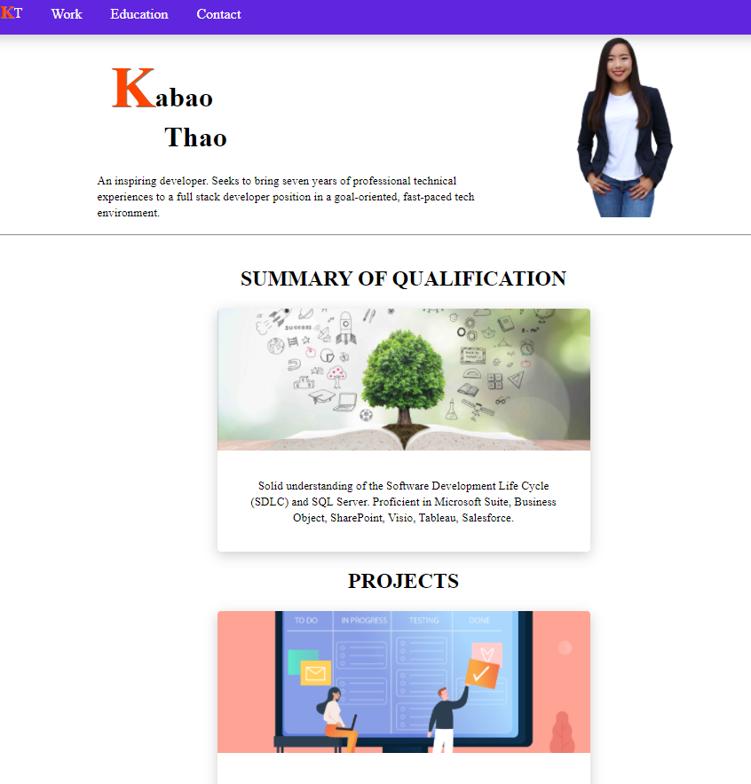

# Portfolio
> Outline a brief description of your project.
> Live demo [_here_](https://kabaothao.github.io/Portfolio/). <!-- If you have the project hosted somewhere, include the link here. -->

## Table of Contents
* [General Info](#general-information)
* [Technologies Used](#technologies-used)
* [Features](#features)
* [Screenshots](#screenshots)
* [Setup](#setup)
* [Usage](#usage)
* [Acknowledgements](#acknowledgements)
* [Contact](#contact)
<!-- * [License](#license) -->

## General Information
- This project is to start building a portfolio to showcase skills and experiences. 
- What is the purpose of your project?
The purpose of this project is to show personal projects along with providing source codes for public view. 
- Why did you undertake it?
To continue to update the portfolio as I complete projects. 

<!-- You don't have to answer all the questions - just the ones relevant to your project. -->

## Technologies Used
- HTML5
- CSS
- Visual Studio

## Features
List the ready features here:
- N/A

## Screenshots

<!-- If you have screenshots you'd like to share, include them here. -->

## Setup
- The URL of the deployed application.
- The URL of the GitHub repository. Give the repository a unique name and include a README describing the project.

## Usage
How does one go about using it?
- To showcase my best work, personality, and talents. It is to show my skills, share my enthusiasm about the profession and give my potential employers and clients a glimpse of how awesome it would be to work with me. 

For example:

.menu {list-style-type: none;
    margin: 0;
    padding: 0;
    overflow: hidden;
    background-color: #6025de;
    box-shadow: 0 4px 15px rgb(0 0 0 / 20%);
}

.menu li {
    float: left;
}
.menu li a {
    display: inline-block;
     color: white;
    text-align: center;
    padding: 14px 16px;
    text-decoration: none;
}

html, body {
    width: 100%;
    margin:0px;
}

.intro {
    display: grid;
    grid-template-columns: 2fr 1fr;
    align-items: center;
    justify-items: center;
    margin-left: 15px;
    max-width: 720px;
    margin: auto;
    
}

.intro div h1, .intro div h5 {
    margin-left: 15px;
}

## Acknowledgements
Give credit here.
- This project was inspired by Trilogy Education.
- Many thanks to Trilogy Education.

## Contact
Created by [@kabaothao](https://github.com/kabaothao) - feel free to contact me!

<!-- Optional -->
<!-- ## License -->
<!-- This project is open source and available under the [... License](). -->

<!-- You don't have to include all sections - just the one's relevant to your project -->
